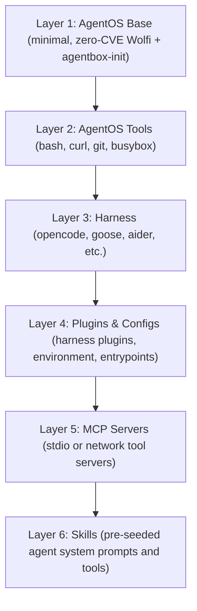

# Agentbox

Agentbox is a framework for building, distributing, and running secure, immutable AI agent containers using a structured 6-layer OCI hierarchy. It allows you to package agent harnesses (like OpenCode or Goose), MCP servers, skills, and configuration into fully declarative container images running on a secure, minimal, Wolfi-based OS with built-in command and network guardrails.

## The 6-Layer OCI Hierarchy



## Features

- **Supply Chain Security**: Foundational OS layers (Base & Tools) are built declaratively with `apko` using signed Wolfi APKs, yielding reproducible, zero-CVE base containers.
- **Unified Manifest**: Configure everything in a single, simple `agentbox.yaml`.
- **Runtime Guardrails**: Strict Command execution and Filesystem limits, mapping to host cgroups/rlimits.
- **Network Policies**: Ingress/egress rules compiled into container-internal `iptables` configuration.
- **Multi-Arch Native Build**: Build pipeline supports parallel native builds for `amd64` and `arm64` without QEMU emulation.

## Getting Started

### Prerequisites

- Go 1.25+
- Podman (preferred) or Docker
- `apko` (for building OS layers locally)

### Build the CLI

```bash
make build
```

### Build an Agent Image

```bash
./bin/agentbox build -f examples/opencode-kimi/agentbox.yaml -t my-agent:latest
```

### Run the Agent Container

```bash
./bin/agentbox run my-agent:latest --runtime podman --env-file ~/.config/opencode/server.env
```

## License

This project is licensed under the MIT License - see the [LICENSE](LICENSE) file for details.
